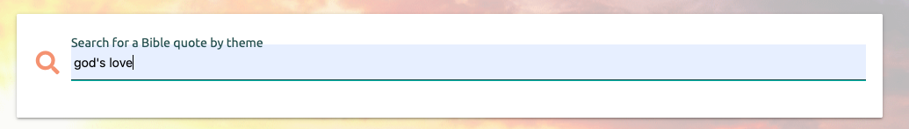

# Bible Quotes 4U

A web-based data-base app using MongoDB and Flask templating for Code Institute's Fullstack Software Development Diploma Milestone 3 project.

## **Preview** 

The site deployed to Heroku can be viewed [here.](https://find-a-bible-quote.herokuapp.com/)

Login details for admin are:

USERNAME: admin

PASSWORD: admin

Previews of the homepage on different devices can be viewed here:

## User Stories

* A user is experiencing a certain emotion or situation and would like to read Bible verses that could help them to understand and deal with that emotion or situation.

* A user would like to see what themes Bible quotes have been added for and view the associated quotes.

* A user would like to add a bible quote that they have found particularly useful in helping them to deal with a certain emotion or situation.

* On finding quotes for a theme, a user wishes to comment on a quote that another has added.  They therefore need to register.

* A user is worried about online abuse so is cautious about registering.

* A returning user would like to use the search by theme feature and comment on the quotes obtained as results. They need to log in to do this.

* A logged in user wants to review all the quotes they have added as they use the app as a collection for their favourites.   They would also like to see if others have commented on their quotes and have the option to reply to comments by commenting further.

* On reviewing the quotes that they have added a user thinks that they would like to update the theme they have given a quote.

* A user enters a quote then realises that they have made a mistake in the quoting of the text. They would like to correct this.

* A user recalls commenting on a quote they particularly liked and would like to look at it again.

* A user looking at their recent commenting activity sees a spelling mistake in one of their comments and would like to correct it.

* One of a user's comments has received negative comments back.   They have thought about it again and now wish to delete their comment.

* A user no longer wants to use the app and wishes to delete the quotes they have added.

* Admin needs a page where they can monitor all site activity and delete false quotes, correct errors in quotes where possible and monitor comments for breaches of site standards, with the functionality to delete comments if necessary.   

## UX

### **1. Strategy**

To create a web app that gives the user an interface to meet the needs of the user stories, connected to a MongoDB database. This will store all the quotes added and associated information so that it can be accessed (Read), added to (Created), edited (Updated) or removed (Deleted).  In this way this project will meet its CRUD requirements.

### **2. Scope**

Features to include:
* A navbar, collapsible for small screens

* Functionality to search for a quote by theme

* Functionality to browse through themes and view associated quotes.

* Login and register functionality

* Functionality for a user to post quotes.

* Functionality for a user to make comments on quotes.

* Functionality for a user to view quotes and associated comments.

* Functionality for a user to review their own quotes and comments and edit or delete them.

* Functionality for an admin user to review all quotes and comments, edit or delete quotes and delete comments.

* An attractive user interface facilitating ease of carrying out all the above actions.

### **3. Structure**

* The app will be responsive on all screen sizes

* There will be a beautiful background image of a sunrise over mountains with the contrast reduced that will exist throughout the site.

* A navbar on large screens with a brand Logo and links for Home, Login and Register for the unlogged in user and Home, Add a Quote, My Quotes, My Comments and Logout for a logged in user.  There will be an extra link, ADMIN, for users logged in as admin.  

* A burger icon in the top nav bar for a collapsed side nav on medium and small screens.

* Login and Register links in the nav which will open modals for login or register criteria to be entered and submitted. 
    * A secondary modal can be launched from the register modal detailing the site's terms and conditions with a button to close.

* Search bar on the homepage which enables users to search for quotes for a chosen theme by typing that theme into the search bar.  The quotes, if any will then be shown on the search results page.

* Description of app and instructions for using it on the homepage. 

* Dropdown to show all the themes for which there are already quotes on the homepage.  Each theme clickable to redirect to a page rendering those quotes. 

* Search results page showing quotes stored in the database for the searched for theme.  
    * If there are no quotes for the searched theme there will be a message saying so and an option to add a quote which is a link to the add quote page or links to login or register to add a quote if the user is not logged in so that they can then add a quote for that theme. 
    * If there are quotes, each quote will be on a card panel which is a collapsible header, showing the book, chapter and verses from the bible, the theme the quote is for, the quote text, which user added the quote and a caret down icon labelled comments.
    * The collapsible body will show the comments about the quote, each on a card panel with which user made the comment. 
    * Below the comments cards but still in the collapsible body for each quote, if the user is logged in there will be a card to make and post a comment for that quote. If they are not logged in there will be a message saying login or register to make a comment. 

* 'Browse results' page showing quotes for the theme they selected from the dropdown on the homepage.
    * Will be indistinguishable in structure from the search results page from the user's perspective, except that there will be no message for no quotes for a theme because only themes with any quote will be shown in the dropdown on the homepage.

* There will be 4 pages navigable from the navbar for the logged in user: Home, Add A Quote, My Quotes and My Comments.  An additional 5th, ADMIN, will be navigable for a user logged in as 'admin'. 

* The Add Quote page where users enter the details of a quote they would like to add: Theme, Book, Chapter, Start Verse, End Verse (optional) and quote Text. 
    * There is a large Add Quote button at the bottom which will submit the quote to the database as an object.

* My Quotes page to show the user all the quotes that they have added. Same structure as Search results page but each quote will have edit and delete buttons on the top right of each quote card.  
    * Possible message that user has not added any quotes yet and link to the Add a Quote page.
    * No links to login or register because user must be already logged in to be on this page.
    * The delete buttons for quotes will open a modal asking the user to confirm the quote delete before deleting it from the database.
    * The Edit buttons on the my quotes page will navigate to an Edit Quote page which looks the same as the add quote page but will be pre-poulated with values for the quote being edited. There will be an option here to cancel the edit, which will return to the My Quotes page or a button to submit the edited qu1ote.

* My Comments page listing the quotes on which a user has commented.  
    * All the comments for a quote will be shown but the ones made by the user will have buttons to edit or delete the comment.  
    * The edit comment button on my quotes page will open a modal with a form for editing the comment.  There will be buttons to submit or cancel this form.  
    * The delete comment button will open a confirm delete modal.

* ADMIN page for users logged in as admin will show all the quotes in the database with their associated comments.
    * Quotes will have buttons leading to the edit page for editing them and to the confirm delete modal for deleting them.  
    * The comments will be displayed for each quote in the same structure as on the other pages.  Admin will have a button with each comment to delete it but not to edit it.

### **4. Skeleton**

The wireframes can be viewed here:

- [Desktop Homepage wireframes](static/assets/images/readme/wireframes/homepage-wireframes-desktop.png)

- [Mobile Homepage wireframes](static/assets/images/readme/wireframes/homepage-wireframes-mobile.png)

- [Desktop Register and Login wireframes](static/assets/images/readme/wireframes/log-reg-wireframes-desktop.png)

- [Mobile Register and Login wireframes](static/assets/images/readme/wireframes/log-reg-wireframes-mobile.png)

- [Desktop Search and Browse results wireframes](static/assets/images/readme/wireframes/search-browse-wireframes-desktop.png)

- [Mobile Search and Browse wireframes](static/assets/images/readme/wireframes/search-browse-wireframes-mobile.png)

- [Desktop Add Quote and Edit Quote wireframes](static/assets/images/readme/wireframes/add-edit-quote-wireframes-desktop.png)

- [Mobile Add Quote and Edit Quote wireframes](static/assets/images/readme/wireframes/add-edit-quote-wireframes-mobile.png)

- [Desktop My Quotes wireframes](static/assets/images/readme/wireframes/my-quotes-wireframes-desktop.png)

- [Mobile My Quotes wireframes](static/assets/images/readme/wireframes/my-quotes-wireframes-mobile.png)

- [Desktop My Comments wireframes](static/assets/images/readme/wireframes/my-comments-wireframes-desktop.png)

- [Mobile My Comments wireframes](static/assets/images/readme/wireframes/my-comments-wireframes-mobile.png)

- [Desktop ADMIN wireframes](static/assets/images/readme/wireframes/admin-wireframes-desktop.png)

- [Mobile ADMIN wireframes](static/assets/images/readme/wireframes/admin-wireframes-mobile.png)

### **5. Surface**

The theme will be the same through out.  The navbar will be red with contrasting white text to compliment the reddish sky at the top of the background image.
The background image will be of the sun with rays over a distant mountain range with a grassy meadow in the foreground.  The exposure will be increased and the contrast reduced to give a paled effect which will not interfere with the site functionality overlaid.

## Features

### Included:
* Responsiveness of the user interface for all screen sizes on all devices.

* Nav bar on large screens and right side nav on medium and small screens.

* A search input to search for quotes by entered theme name

* A dropdown menu containing existing themes that have quotes associated where each theme is a link to view quotes for that theme

* Register and login functionality with requirement to confirm password and agree to terms and conditions at registration.

* A page for a logged in user to add a bible quote and select a pre-existing theme or enter a new theme for it.

* A page displaying all the quotes the current logged in user has added with associated comments for quotes with the option for the user to edit or delete any of these quotes

* A page displaying all the quotes the current logged in user has commented on with all associated comments for quotes and the option for the user to edit or delete any of their own comments.

* A page only visible to a user logged in as 'admin' which displays all quotes in the database with associated comments and the option to edit or delete a quote and delete a comment.

* Requirement of secondary confirmation of deletion of a quote or comment before it is actually deleted.

* Validation of inputs:
    * Whitespace only will not be accepted
    * Whitespace will not be accepted at all in usernames and passwords.
    * Only alphanumeric characters may be used for usernames.
    * Correct formats for quote book, chapter and verses will be required.

* Flash messages giving users feedback for their actions.

### Left to implement

* Connection to an API loading accurate bible text when a book chapter and verse are selected from menus containing only true bible books, chapters of those books and verses of those chapters.  The desired version of the bible would also need selecting.

* User profile pages containing optionally entered name, location and contact info.  Users able to choose what information other users are able to see. 

* Keep the collapsible body for comments open once a comment has been made and the page reloaded so that the comment can be seen immediately.  Also automatically scroll down to where the new comment is rendering if it is off the bottom of the page, again so that it can immediately be seen.

* Functionality to reply to specific comments.

## Technologies

### Languages

- [HTML5](https://en.wikipedia.org/wiki/HTML5)

- [CSS3](https://en.wikipedia.org/wiki/Cascading_Style_Sheets)

- [Python](https://en.wikipedia.org/wiki/Python_(programming_language))

- [Jinja](https://en.wikipedia.org/wiki/Jinja_%28template_engine%29)

- [JavaScript](https://en.wikipedia.org/wiki/JavaScript)

### Frameworks, Libraries and Tools 

- [Flask:](https://flask.palletsprojects.com/en/2.0.x/)
    * Templating used throughout the site

- [Materialize (version 1.0.0):](https://materializecss.com/) 
    * HTML CSS and javascript used throughout the site for responsiveness, styling and components: Nav bar and side nav, card panels, collapsibles, form elements and buttons.

- [jQuery](https://jquery.com/)
    * Used for initializing Materialize components, validating the select elements and fading out the flashed messages.

- [Heroku](https://id.heroku.com/login)
    * Cloud platform used for deployment

- [MongoDB](https://www.mongodb.com/)
    * Cloud storage of non relational database

- [Werkzeug](https://werkzeug.palletsprojects.com/en/2.0.x/)
    * Helper user with debugging python
    * Security helper used for generating password hash

- [Pymongo](https://pymongo.readthedocs.io/en/stable/index.html)
    * Tools for working with MongoDB from Python

- [Google Fonts:](https://fonts.google.com/)
    * Used to import the 'Ubuntu' font used throughout the site.

- [Git:](https://git-scm.com/)
    * Git was used for version control by utilizing the Gitpod terminal to commit to Git and Push to GitHub.

- [GitHub:](https://github.com/)
    * GitHub is used to store the projects code after being pushed from Git.

- [GitPod:](https://www.gitpod.io/)
    * IDE used for development and testing.

- [Google Chrome Dev Tools:](https://developer.chrome.com/docs/devtools/)
    * Used throughout the development process to view the console and locate errors and assist with layout and styling.

- [Font Awesome:](https://fontawesome.com/)
    * Icons throughout the site.

- [COMPRESS PNG:](https://compresspng.com/)
    * Used to compress background image to improve loading time.

- [Balsamiq:](https://balsamiq.com/)
    * Creation of the wireframe mock ups.

- [Am I Responsive:](http://ami.responsivedesign.is/)
    * Checking of responsiveness and creation of the previews in this README.

## **Testing**

### **Third Party Tools/Services**

- [W3C HTML Validator](https://validator.w3.org/nu/#textarea): Validation by direct URL input:
    * Code passes through with no errors
    * Only warnings are due to the use of either name attribute in form elements, (warned as being unnecessary but in fact needed for Python code) or sections lacking headings which are not desirable for this site.

- [W3C CSS Validator](https://jigsaw.w3.org/css-validator/validator): Used to validate the css code from all style.css by pasting the code into this page:
    * Passed with no errors or warnings.

- [PEP8](http://pep8online.com/): Online python checking tool used to validate Python code:
    * Code passed with no errors or warnings.

- [Chrome Lighthouse Extension](https://developers.google.com/web/tools/lighthouse/): Used to audit the site:   
    * Some improvements and changes were needed to improve lighthouse scores.  These are summarised in this table:

    

    * A summary of the subsequent lighthouse results are shown here:
     

### Manual Testing
**Bugs and fixes**

* Collapsible header would only allow one line of content so not all the information for a quote could be rendered.
    * It was ovelaid with a card panel which could be formatted.

* Whitespace being submitted to the database searched for as a search query.  Anywhere that there is a text input, it proved impossible using a pattern attribute to specify that special characters were allowed but just whitespace was not.
    * Fixed in python by making a variable of the text input, using .replace(" ", "") on the variable, which replaced all whitespace with no space.  A check was then run to see if the variable then had a value of "" (no space) and if it did, flashing a message to the user that the input had not value and returning to where the input came from.

* Search for theme was accepting key words for searching with instead of an exact phrase.  
    a variable had to be made of the phrase wrapped in escaped quotes and then made into an f string.  This variable was then used for the theme search.

* Quotes text was being rendered on the template enclosed in quotes.  If the user then inputted their quote text wrapped in quotes, the quote would render wrapped in double quotes.
    * It would be possible to remove all quotes added by a user for quote text using .replace(). However if single quotes were replaced (which would be necessary to avoid the issue) then apostrophes would also be removed.  Therefore the quotes were removed from the template and quotes are not shown wrapped in them unless the user submits them so.

* If an admin user was editing a quote for a mistake, when the edit was submitted then they would be updated as the user that added the quote as they are the current session user. 
    * Change the "added_by" field in the new object that will update the quote to be the quote it self's own added by, using "added_by" = quote["added_by"] in the new object so that added_by does not get changed.

* If a user chose to add a new theme when adding or editing a quote but then manually entered a theme that already existed, a duplicate theme got added to the database.
    * Before submitting the new theme, find a list of quotes form the database that have that new theme for their theme.  If that list length is zero then the added new theme genuinely is new.

* Allowing a password to contain special characters but not whitespace.
    * again .replace had to be used removing any whitespace but then checking against the original input.  If they still matched then the input did not have any whitespace and the function could continue.  Otherwise a message is flashed to the user and the function returned.

* There was no check against a user adding a quote more than once, leading to duplicate quotes in the data base by that user.
    Some python has been added in add quote to do a check in the database for quotes that match before adding a new quote. If there are any then flashing to the user that hey have already added this quote for this theme.  This same logic was used to prevent duplication of quotes in the database after a quote was edited.  It was then applied to adding and editing comments to also prevent those being duplicated.

* There was no option to return to the current page after commenting (which could come from search_results.html, browse_themes.html, My Quotes, My Comments or Admin).  
    Thanks to my mentor for inventing code for this which works for returning to any page if it was the previous page after commenting.  The POST method had to be removed from the Search view, but only GET is in fact needed for searching.
    I then implemented this logic so that delete quote and delete comment can either return to My Quotes or My Comments respectively or to the Admin page where both are needed.  As explained in pending issues it will not work for Edit quote because of the necessary POST method.

**Functionality**
1. All the features were tested on the following and were confirmed to be functioning correctly, following the bug fixes detailed above: 

* Browsers:
    * Google Chrome
    * Safari
    * Mozilla 
    * MicroSoft EDGE

* Devices:
    * 13" MacBook Air 
    * iPhone 7
    * Samsung S8

* Other devices were tested through Google Chrome DevTools:
    * Moto G4
    * Galaxy S5
    * Pixel 2
    * Pixel 2 XL
    * iPhone 5/SE 
    * iPhone 6/7/8 
    * iPhone 6/7/8 Plus
    * iPhone X 
    * iPad
    * iPad Pro 
    * Surface Duo 
    * Galaxy Fold 

* Responsiveness was tested on the following screen widths using DevTools (Sizes in px):
    * 320 
    * 375 
    * 425 
    * 768
    * 1024
    * 1440

**Pending Issues**

* If an Admin user edits a quote from their Admin page, the route for edit comment will reroute back to My Quotes page, as it would do for a regular user after editing a quote, not back to the admin page.  It is not possible to redirect the edit quote view back to the page that it was called from because a POST method is necessarily being used to send an updated quote object to the database.   It is only possible to implement this functionality if the only method used in the route is GET.  Thus an admin user must manually navigate themselves back to their Admin page from My Quotes if they wish to return there.
    * Credit: My Code Institute mentor, Sandeep Aggarwal, for assistance with making this functionality work for other routes and identifying the reason for it not working here.

* There is still no defence against 2 different users adding the same quote for the same theme.  They will be different objects because the session user adding them will be different so the database will accept them.
    * This could be addressed with more time available.

* There is occasionally an issue with inputs failing to focus when clicked-on or touched on a touch screen. There is no logic to where or when it may occur.  It is inexplicable, possibly to do with materialize.
    * This issue can be overcome on a computer by using the tab key to move into the unresponsive field instead on the mouse.

### User Stories

Each user story was tested individually and consideration given to how it may be satisfied by this site.

* A user is experiencing a certain emotion or situation and would like to read Bible verses that could help them to understand and deal with that emotion or situation.
    * They can enter their emotion or situation as a 'theme' in the search bar on the home page to see if there are any quotes to comfort them.

 

* A user would like to see what themes Bible quotes have been added for and associated quotes for those.
    * The homepage dropdown shows themes that exist in the database
    * Selecting one of these themes will show quotes associated with it

 
    

  

* A user would like to add a bible quote that they have found particularly useful in helping them to deal with a certain emotion or situation.
    * There is a form on the Add a Quote page to fill in the details of a bible quote and choose a theme for it, either a pre-existing theme or a new one added.

 

* On finding quotes for a theme, a user wishes to comment on a quote that another has added.  They therefore need to register.
    * There is a modal to submit a registration form, triggered from any of the links that say Register

 

* A user is worried about online abuse so is cautious about registering.
    * The terms and conditions modal clearly stated that abusive comments are not tolerated by this site and will be deleted by admin.  This should reassure this user.

 

* A returning user would like to login.
    * There is a modal to submit a login form triggered by any of the links that say Login.

 

* A returning user would like to use the search by theme feature and comment on the quotes obtained as results.
    * They can enter their theme in the search bar
    * The resulting comments rendered have the option to comment on them for a logged in user

 

* A logged in user wants to review all the quotes they have added as they use the app as a collection for their favourites.   They would also like to see if others have commented on their quotes and have the option to reply to comments by commenting further.
    * All the quotes the session user has added are shown together on the My Quotes page, with their associated comments in the collapsible body for each quote.

 

* On reviewing the quotes that they have added a user thinks that they would like to update the theme they have given a quote.
    * A new theme can be changed on the Edit Quote form

 

* A user enters a quote then realises that they have made a mistake in the quoting of the text or attribution.
    * They can reach the Edit Quote form where they can correct this by using the comment icon button next to a quote on the My Quotes page.

 

* A user recalls commenting on a quote they particularly liked and would like to look at it again.
    * A user can view all the quotes they have commented on on the My Comments page.

 

* A user looking at their recent commenting activity sees a spelling mistake in one of their comments and would like to correct it.
    * Next to the user's comments on the my comments page there is an icon button to raise a modal with a form to edit the comment on.

 

* One of a user's comments has received negaive comments back.   They have thought about it again and now wish to delete their comment.
    * Next to each of their own comments on the My Comments page there is an icon trash button which raises a modal to confirm deleting the comment.

 

 

 * A user no longer wants to use the app and wishes to delete the quotes they have added.
    * User's quotes can be deleted from My Quotes page using the trash icon button next to the quote which raises the confirm delete modal.

* Admin needs a page where they can monitor all site activity and delete false quotes, correct errors in quotes where possible and monitor comments for breaches of site standards, with the functionality to delete comments if necessary. 
    * All quotes with all comments are shown on the admin page to which only a user logged in as admin has access.  Here there are icon buttons to edit or delete quotes and delete comments.

 

 ### CRUD testing

 The site meets the requirement to Create, Read, Update and Delete data from a database in the following ways:

 #### Create

 * Entries can be created in the database for this site by:
    * Registering a user adds a user document to the 'Users' collection

    * Posting a bible quote using the 'Post a Quote form' adds a quote object document to the Quotes collection in the database

    * If a new theme is entered on the 'Post a Quote' or 'Edit Quote' form, a theme document gets added to the themes collection.

    * If a quote is commented on, a comment object document is added to the comments collection.

#### Read

* Data is retrieved from the database and displayed to the user in the following ways:

    * The Browse Themes dropdown on the homepage displays all the themes in the themes collection

    * browse_themes.html and search_results.html display the following information for quotes that have the theme as a key value that has been selected from the browse dropdown or searched for in the search bar: Theme, Book, Chapter, Start verse, end verse (if quote is more than one verse), quote text, and the username of the user that added the quote.

    * The My Quotes page displays the same information for a quote as above, except not user, for all the quotes from the quotes collection that have the key "added_by" value of the session user's username.  User name need not be displayed here as it is always the session user for this page.

    * Comments made about quotes, and the username of the user that made the comment, are retrieved and displayed for all quotes displayed on the site, in the format of a list in a collapsible body underneath the relevant quote they are for. The quote_id field value of the comment from the comments collection matches the string of the Object ID of the quote in the quotes collection that they are for.  In this way quotes and associated comments can be displayed together.
    Once the object id of the quote was made a string in python, the jinja map filter was used on the templates to map the actual quote id to the quote_id field of the comment.   The exception to this was the My Comments page.

    * The My Comments page retrieves from the database and then displays the same information as above for (theme, book, chapter, verses, text and added by) quotes that have a stringified Object ID equal to the value of the quote_id field of comments in the comments collection, but only for comments that also have a commented_by value equal to the username of the current session user.  In this way, The My Comments page renders all quotes on which the current session user has commented.   As with all other quotes displayed on the site, all the comments for each quote, and the user that commented, are then displayed with each quote (not just the comments made by the session user, these were only used as the starting point for filtering the quotes).  
    It was not possible to use Jinja map on the template to obtain the correct quotes for this page, due to the 2 steps filtering.  Instead a list of commented quotes was first built in python before being passed to the template.  See credits regarding this.

    * The Admin page retrieves all quotes from the database and then again displays the same information as other pages for them.  Comments relevant to quotes and the user that made the comment are again also retrieved and displayed.

#### Update

* The database is updated in the following ways:

    * If a quote is edited using the Edit quote page, a new quote object is built in the edit_comment view with values from the edit quote form. The quote with Object Id that matched the quote_id parameter that was passed into the view is then updated with the new object.

    * If a comment is edited using the single input form raised from the My Comments page by pressing the edit icon button next to the comment, in the view for edit comment a new object is built for the comment with comment text from the form, the same quote id that the comment was originally for and commented by as the session user (the original user that made the comment is the only one that has the option to edit it).  The comment in the comments collection in the database is then located by having Object ID the same as the one that is passed into the view is then updated with the new object that has been built in the view.

#### Delete
* Data is deleted from the database in the following ways:

    * If the theme for a quote is changed on the edit quote form, a check is run to see if there are any quotes left which have the edited quote's original theme as their theme value.  If there are no more quotes with that theme value, that theme gets removed (deleted) from the database.

    * If the delete quote button for a quote is pressed and then confirmed from either the My quotes page or Admin page, that quote gets deleted from the comments collection.  A check is again run to see if there are any other quotes left with theme the same as the quote that was deleted.  If there are not, the deleted quote's theme is also deleted from the themes collection.  Comments for the deleted quote, which have a value of their quote_id field equal to the string of the Object ID of the deleted quote, are also deleted from the comments collection.

    * If a comment is deleted from pressing the delete icon button next to it either on the My Comments or Admin pages and then confirming the delete, the comment in the database with Object ID equal to that of the comment that the delete button was pressed from will get removed (deleted) from the comments collection in the database.

## Deployment

### Deployment to Heroku:

The site was deployed to Heroku following these steps:

1.  Open the workspace in Gitpod for Find-A-Bible-Quote from the Gitpod dashboard 

2. In the terminal of the running workspace type (without quotes): "pip3 freeze --local > requirements.txt" then press enter.

    

3.  Then type in the terminal: "echo web: python app.py > Procfile" and press enter

    

4. Open the Procfile and the delete blank line at the end

     

5. Navigate to [Heroku](https://id.heroku.com/login) and login

    

6. In the Heroku dashboard click the New button in the top right corner, then select 'Create New App'

    

7. Enter the name 'Find-A-Bible-Quote' for App Name and select the region as Europe

    

8. On the next page in the section 'Deploy' select 'Connect to GitHub' as the Deployment method

    

9. Then type the name of this GitHub repository ('find-a-bible-quote') in the search box to locate it

10. Once the repository is located, click the connect button on the right to connect to it

    

11. Click on the Settings tab for the app

     

12. Then click 'Reveal Config Vars'

    

13. Manually enter the following config vars shown in the screenshot below, taking care not to add any quotes to the keys or values.  The SECRET_KEY must be copied over from the env.py file in the workspace.  The MONGO_URI is currently left blank

    

14. Go back to the workspace terminal and type 'git status' to confirm that requirements.txt and Procfile are the only 2 new files.  

15. Type "git add ." to add these new files to the staging area. 

16. Type "git commit -m "Add requirements.txt and Procfile" and press enter to commit those files to the repository. 

17. Then type "git push" to push these files to GitHub

    

18. Go back to Heroku and under the Deploy tab click 'Enable Automatic Deploys'. The project's only branch is 'main' so this will be selected.

    

    

19. Then for Manual deploy click 'Deploy Branch', again 'main' will be selected

    

20. Wait a few minutes for the app to build and then the following message will appear.  Click 'View' to open the new app.

    

## Credits

### Concept

* The idea for the site was conceived by me

### Code

* Nav bar, side nav, card panels, drop down, collapsibles, input fields, buttons and modal:

    * [Materialize (version 1.0.0):](https://materializecss.com/)  

* Commented code in app.py taken or adapted from Code Institute Lessons.  

* Commented code snippet written by named Code Institute tutor Sean.

* Code for return redirect(redirect_url) conceived by my Code Institute mentor, some implemented with his help, some by me independently.

* Creation of env.py, import of dependencies, creation of Procfile and requirements.txt and deployment procedure were all taken from Code Institute lessons.

* All other code was written by me.

### Sources
#### Python
* Flash messages
    https://pythonprogramming.net/flash-flask-tutorial/

* .replace()
    https://www.tutorialspoint.com/python/string_replace.htm

* Searching for an exact phrase in MongoDB
    https://docs.mongodb.com/manual/reference/operator/query/text/#std-label-text-operator-phrases

#### jQery
* Fading flash messages

    https://stackoverflow.com/questions/24278586/fade-not-working-for-flash-message-in-rails

### Images

* Background Image

    * https://www.pixelstalk.net/

### Acknowledgements

* Code Institute Tutor Support: Michael, John, Johann, Jo but over and above them all, Sean, without whose patience and brainwaves this project would have floundered completely.

* My Code Institute Mentor, Sandeep Aggarwal, for writing some of the more complicated code that I didn't foresee being needed when I undertook this project.

